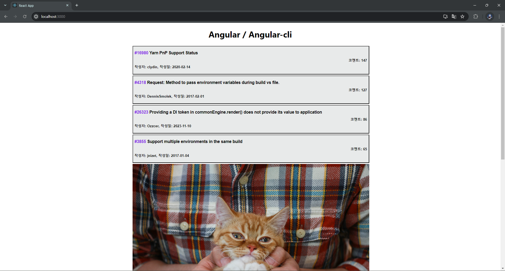
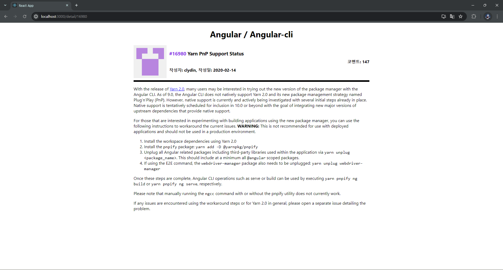

# POB_task_1

- 파일 구성

1. pages
   - detail.jsx: 상세페이지 구현
   - list.jsx: 받아온 데이터 목록 구현
   - header.js: 공통적으로 사용되는 컴포넌트
   - IMG_2126.jpg: 광고에 사용될 이미지
2. App.js
   router 연결, context 주입
3. router.js
   router 생성
4. store.js
   context 생성

- 전체적인 동작 설명
  GitHub REST API에서 특정 reository의 issue를 받아와
  메인 페이지에서 버튼 형식으로 배치 하였습니다.
  메인 페이지의 버튼들은 무한 스크롤 방식으로 추가 로드 되게 하였습니다.
  배치된 버튼을 클릭하면 해당되는 issue의 내용을 상세 페이지에서 확인할 수 있습니다.

---

- 할 일 목록

1. 뷰를 짜야해
2. 뷰를 짜야하는데 뭐뭐를 짜야하는 지 결정해야해
3. 라우팅을 해야해
4. 네트워크 요청을 해야해
5. 받아온 데이터 스토어에 넣어줘야 해 -> context API 써야 해
6. 뷰에다가 데이터를 뿌려야 해
7. 스타일 만져야해 (styled-components)
